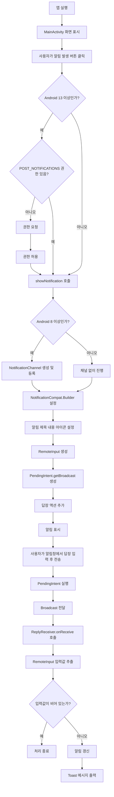

# Ch10 Notification 전체 흐름도

## 0. 다이어그램



## 1. 전체 흐름도

```text
[앱 실행]
   |
   v
[MainActivity 화면 표시]
   |
   v
[사용자가 '알림 발생' 버튼 클릭]
   |
   v
[Android 13 이상인지 확인]
   |
   +-- 예 --> [POST_NOTIFICATIONS 권한 확인]
   |             |
   |             +-- 권한 없음 --> [권한 요청] --> [권한 허용 시 showNotification() 호출]
   |             |
   |             +-- 권한 있음 --> [showNotification() 호출]
   |
   +-- 아니오 --> [showNotification() 호출]
                        |
                        v
              [Android 8 이상인지 확인]
                        |
                        +-- 예 --> [NotificationChannel 생성 및 등록]
                        |
                        +-- 아니오 --> [채널 없이 진행]
                        |
                        v
              [NotificationCompat.Builder 설정]
                        |
                        v
              [알림 제목/내용/아이콘 설정]
                        |
                        v
              [RemoteInput 생성]
                        |
                        v
              [PendingIntent.getBroadcast() 생성]
                        |
                        v
              [알림의 '답장' 액션 추가]
                        |
                        v
              [알림 표시]
                        |
                        v
              [사용자가 알림창에서 답장 입력 후 전송]
                        |
                        v
              [PendingIntent 실행]
                        |
                        v
              [Broadcast 전달]
                        |
                        v
              [ReplyReceiver.onReceive() 호출]
                        |
                        v
              [RemoteInput 입력값 추출]
                        |
                        v
              [입력값이 비어 있는지 확인]
                        |
                        +-- 비어 있음 --> [처리 종료]
                        |
                        +-- 값 있음 --> [알림 갱신]
                                         |
                                         v
                               [Toast 메시지 출력]
```

## 2. 흐름 설명

### 2-1. MainActivity 단계

- 앱이 실행되면 `MainActivity`가 화면을 표시한다.
- 사용자가 `알림 발생` 버튼을 누르면 `showNotification()` 실행 여부를 판단한다.
- Android 13 이상에서는 먼저 알림 권한을 확인한다.
- 권한이 허용되면 알림 생성 단계로 넘어간다.

### 2-2. 알림 생성 단계

- Android 8 이상에서는 `NotificationChannel`을 먼저 생성해야 한다.
- 그 다음 `NotificationCompat.Builder`로 제목, 내용, 아이콘을 설정한다.
- `RemoteInput`을 이용해 알림에서 바로 답장을 입력할 수 있게 만든다.
- `PendingIntent.getBroadcast()`를 사용해 답장 이벤트를 `ReplyReceiver`로 보낸다.

### 2-3. ReplyReceiver 단계

- 사용자가 알림에서 답장을 입력하고 전송하면 `Broadcast`가 발생한다.
- `ReplyReceiver`가 이를 수신하고 `RemoteInput` 값을 추출한다.
- 답장 내용이 있으면 그 문자열로 알림 내용을 다시 갱신한다.
- 마지막으로 토스트 메시지로 처리 완료를 알린다.

## 3. 핵심 구조 요약

- `MainActivity`
  - UI 표시
  - 권한 확인
  - 알림 생성

- `PendingIntent + Broadcast`
  - 알림 액션 이벤트 전달

- `ReplyReceiver`
  - 백그라운드에서 답장 입력 처리
  - 알림 갱신

- `RemoteInput`
  - 알림창에서 직접 텍스트 입력 가능
