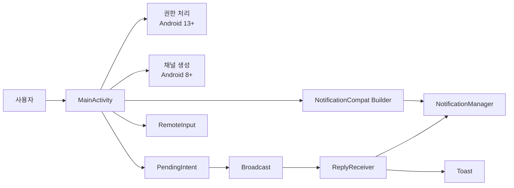

# Ch10 Notification SW 설계구조

## 0. 구조 다이어그램



## 1. 설계 개요

이 앱은 카카오톡 스타일의 알림 답장 기능을 구현한 예제이다.  
핵심 설계는 `화면 처리`, `알림 생성`, `이벤트 전달`, `백그라운드 입력 처리`를 분리하는 것이다.

- `MainActivity`
  - 사용자 화면 표시
  - 버튼 클릭 이벤트 처리
  - 알림 권한 확인
  - 알림 생성

- `ReplyReceiver`
  - 알림 답장 이벤트 수신
  - `RemoteInput` 입력값 추출
  - 답장 결과 반영 알림 갱신

- `NotificationConstants`
  - 채널 ID, 알림 ID, 키 값을 공용 상수로 관리

## 2. 구조도

```text
[User]
   |
   v
[MainActivity]
   |
   +-- 권한 확인 (Android 13+)
   |
   +-- NotificationChannel 생성 (Android 8+)
   |
   +-- NotificationCompat.Builder 설정
   |
   +-- RemoteInput 생성
   |
   +-- PendingIntent.getBroadcast()
   |
   v
[NotificationManager]
   |
   v
[알림 표시]
   |
   v
[답장 버튼 클릭]
   |
   v
[PendingIntent]
   |
   v
[Broadcast]
   |
   v
[ReplyReceiver]
   |
   +-- RemoteInput 입력값 추출
   +-- 알림 다시 구성
   +-- NotificationManager로 알림 갱신
   +-- Toast 출력
```

## 3. 역할 분리

### 3-1. MainActivity

- 앱의 메인 화면을 담당한다.
- 사용자가 버튼을 누르면 알림 생성 프로세스를 시작한다.
- Android 13 이상에서는 `POST_NOTIFICATIONS` 권한을 먼저 확인한다.
- Android 8 이상에서는 알림 채널을 생성한 뒤 알림을 만든다.
- 알림의 `답장` 액션을 `PendingIntent + Broadcast` 방식으로 연결한다.

### 3-2. ReplyReceiver

- 알림 액션에서 발생한 Broadcast를 수신한다.
- `RemoteInput`으로 전달된 문자열을 가져온다.
- 사용자가 입력한 답장 내용을 반영하여 알림을 다시 생성한다.
- Activity를 다시 열지 않고도 입력 처리를 수행한다.

### 3-3. NotificationConstants

- `CHANNEL_ID`, `CHANNEL_NAME`, `NOTIFICATION_ID`를 관리한다.
- `KEY_TEXT_REPLY`, `EXTRA_SENDER`, `EXTRA_MESSAGE`를 한 곳에서 관리한다.
- `MainActivity`와 `ReplyReceiver`가 같은 키를 안정적으로 공유하게 한다.

## 4. 이벤트 기반 설계

이 앱은 이벤트 기반 구조로 설계되었다.

- `사용자 버튼 클릭 이벤트`
  - `MainActivity`가 처리한다.
- `알림의 답장 액션 이벤트`
  - `PendingIntent`를 통해 시스템으로 전달된다.
- `Broadcast 수신 이벤트`
  - `ReplyReceiver`가 처리한다.

즉, 화면과 입력 처리를 직접 연결하지 않고 이벤트를 매개로 느슨하게 연결한 구조이다.

## 5. PendingIntent + Broadcast 구조

이 구조를 사용한 이유는 알림에서 발생한 이벤트를 Activity가 아닌 Receiver에서 처리하기 위해서이다.

- 사용자가 알림의 `답장` 버튼을 누른다.
- 시스템이 `PendingIntent`를 실행한다.
- `Broadcast`가 전달된다.
- `ReplyReceiver`가 이를 받아서 입력값을 처리한다.

이 방식의 장점은 다음과 같다.

- Activity를 다시 열 필요가 없다.
- 백그라운드에서도 입력 이벤트를 처리할 수 있다.
- 채팅 앱과 같은 알림 답장 구조에 적합하다.

## 6. RemoteInput 설계

`RemoteInput`은 알림창에서 직접 텍스트를 입력할 수 있게 해 주는 핵심 기술이다.

- 사용자는 앱을 열지 않고도 알림창에서 답장을 입력할 수 있다.
- 입력된 문자열은 `Intent`에 담겨 `ReplyReceiver`로 전달된다.
- `ReplyReceiver`는 이 값을 꺼내어 알림을 다시 갱신한다.

흐름은 다음과 같다.

```text
Notification -> RemoteInput 입력 -> Intent 전달 -> ReplyReceiver 처리
```

## 7. 버전별 분기 설계

### 7-1. Android 13 이상

- `POST_NOTIFICATIONS` 런타임 권한이 필요하다.
- 권한이 허용되지 않으면 먼저 권한 요청을 해야 한다.
- 권한 허용 후에만 알림을 생성할 수 있다.

### 7-2. Android 8 이상

- `NotificationChannel` 생성이 필수이다.
- 채널을 먼저 등록한 뒤 `NotificationCompat.Builder`에 채널 ID를 연결해야 한다.

### 7-3. 설계상 의미

- `Android 13` 분기는 `권한 처리`를 위한 분기이다.
- `Android 8` 분기는 `채널 생성`을 위한 분기이다.
- 두 분기는 서로 다른 기능 기준이므로 코드에 각각 별도로 존재해야 한다.

## 8. 설계 의도 요약

- `MainActivity`는 화면과 알림 생성만 담당한다.
- `ReplyReceiver`는 답장 입력 처리만 담당한다.
- `PendingIntent + Broadcast`로 이벤트 전달을 분리했다.
- `RemoteInput`으로 알림창 직접 입력 기능을 구현했다.
- 버전별 요구사항인 `권한`과 `채널`을 각각 분리해서 설계했다.

이 구조는 채팅 앱 알림 시스템의 기본 구조를 이해하기에 적합한 설계이다.
